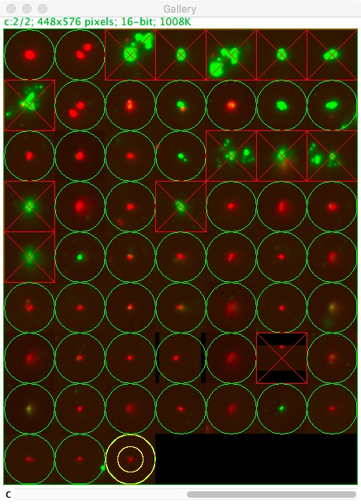

# SynaptosomesMacro
*This toolset is aimed at quantifying the proteins' proximity and their recruitment on synaptosomes, on a structure per structure basis.*

## What was the user's request ?
The user has a set of two channels acquisitions, captured on a widefield microscope. The sample is a spread of isolated synaptosomes, labelled for two proteins of interest. The aim is to quantify the proteins' proximity and their recruitment on the structures, on a structure per structure basis.

## How does it work ?
The macro works in a sequential fashion: in order to isolate synaptosomes, images are first pre-processed then segmented. Candidates particles are then displayed for the user to pick-up the actual structures of interest and reject false positive detections (aggregates, precipitated antibody, dust etc...). Analysis is then performed on validated synaptosomes, and extracted data displayed both as tables and graphs.

#### Graphical user interface:

The user is provided withn a Graphical User Interface (GUI) from where (s)he should select the images to work with, fill in the labelling tags (tags to be reused to name the different outputs) and parameters for pre-processing and analysis:

* *Size of detection square*: used to isolate each synaptosome.
* *Radius for spots filtering*: radius used to perform local filtering during the pre-processing step (gaussian blur and median filtering).
* *Noise tolerance for spots detection*: extend to which the intensity of a pixel should be above adjacent pixels' intensities to be considered as a local maximum.
* *Min size for spots*: during pre-processing, all input images are fused and filtered to end up with "blobs" from which synaptosomes are delineated. This parameter is the minimum blob area to be considered as a particle of interest.
* *Max size for spots*: same as above, dealing with the maximum size.
* *Size for the quantification circle square*: diameter of the circular ROI used to quantify the synaptosome-associated signal.
* *Pixel size in microns*: Size, in physical units, of a single pixel.

#### Pre-processing images:

1. In order to end up with similar segmentation procedure between all images of a set, images are first normalised. The procedure relies on centering then reduicing the images' intensity. This step is achieved by:
	1. Transtyping the images to 32-bits.
	2. Subtracting the image's average intensity to all pixels (centering step).
	3. Dividing the image by its intensities' standard deviation (reduicing step).
2. On all input images, structures of interest are detected, making the assomption they are close enough in all channels. If so, hen fusing all normalised images, one should end up having blob-like, to be detected as spot-like structures:
	1. All normalised images (all labels) are grouped into a single stack.
	2. A maximum intensity projection is performed.
	3. The projection is subjected to gaussian blurring (default radius: 3 pixels).
	4. The image is median filtered (default radius: 3 pixels).
	5. A search for local maxima is performed (default tolerance to noise: 3).
	6. For each retrieved maximum, the "magic wand" tool is activated on the spot, generating a ROI surrounding each "blob". In case the delineated are falls into the user-specified range (default: minim 5 pixels, maximum 100 pixels), a square ROI is centered over the picked point (default size: 64 pixels) and is added to the ROI Manager.
3. Both original images are activated and overlayed, generating a composite image.
4. On the composite image, all ROIs are activated in turn and the corresponding portion of the image is duplicated.
5. All duplicates are asembled into a stack and a montage ("Gallery") is generated.

#### Reviewing synaptosome-candidates:

1. The ROI Manager is emptied and new ROIs are generated. At first, those ROIs are green circles, on per thumbnail on the gallery.
2. The gallery is displayed to the user.
3. A user interaction is required to validate each detection: to change the status of one thumbnail (from validate to non-valide or the opposite way round), click on the thumbnail. The ROI should go from a green circle (valide) to a red crossed rectangle (non valide) or the opposite way round.
4. Once all candidates have been reviewed, press on the space bar to proceed to next step.

#### Data extraction:

1. A circular region of interest is drawn over each validated structure candidate (default radius 32 pixels). The average intensity is extracted and logged for both channels to the results table.
2. The coordinates of the centroid for the ROI is also logged for each channel.
3. Having the two centroids' coordinates (one per channel), the distance between both is computed, calibrated (according to the provided calibration, default: 0.103 microns/pixel) and logged to the results table .
4. A donut-like ROI is then drawn, which width corresponds to each thumbnails' width, and excluding the circular ROI that has been quantified during step 1. This ROI is used to evaluate local background. This information is logged to the results table for both channels.
5. A table is saved containing all the intensity-based information, as comma-separated values. All values are rounded. This file format allows importing data to a flow cytometry software for further analysis (user's request). The first intend was to use the FCS format (see: [FCS file format by the International Society for Advancement in Cytometry](https://isac-net.org/page/Data-Standards)).
6. Three graphs are plotted:
	1. *Cytofluorogram of raw intensities*.
	2. *Cytofluorogram of background-corrected intensities*.
	3. *Distribution of distances*: the histogram is drawn by performing data grouping so that 128 bins are displayed. This graph is intended for initial experiment's evaluation, not for definitive conclusions to be drawn !!!

	
7. A synthetic image is generated: from the coordinates stored in the results table, small hollow squares are drawn. Please take into consideration the results are decimals, whilst the coordinates on the image are non decimals: this image is therfore to be interpreted with great care, and used only as a rough quality control image of the detection method.

**_Please see the Revisions section for additionnal informations about recently implemented features_**

## How to use it ?
### Macro ImageJ (versions 1 to 3):

1. Update ImageJ : Help/update puis Ok.
2. Drag and drop the macro file onto ImageJ's toolbar.
3. Open both images to analyze.
4. Navigate to Macro/Run Macro within the macro window.

### Toolset ImageJ (version 4 to 6):

1. Update ImageJ : Help/update puis Ok.
2. Copy/Paste the macro file to ImageJ's instalaltion folder, in macros/toolset.
3. Under the ImageJ toolbar, on the right-most side, click on the red double arrow and select the appropriate toolset (choose "Startup macro" to go back to tthe original status).
4. Default ImageJ tools have partly been replaced with your toolset's buttons.

## Revisions:
### Version 1: 20/02/17 

### Version 2: 27/07/17
* Added the export to FCS-like file format.

### Version 3: 21/12/17
Implemented exception handeling for both the following situations:

* In case no synaptsome was found, the macro went crazy, trying to analyse the non existing panel image....
* In case the image is distance calibrated, the area criterion was trying to compare the user input area limits expressed as pixels with the measured area experessed as distance units.... therefore excluding all ROIs.

### Version 4: 09/02/18
Conversion of the macro to a toolset.

The users requested the following features:

* Be able to process multiple files and pull the "CytoFile" files between analysis of a same experimental condition.
* Autosave the ouput of the macro.
* Modify default color-coding: Channel 1 in green, Channel 2 in magenta and Channel 3 in blue.
* Change the default parameters (Set measurements) to display 4 decimals.

The macro now takes the form of a toolset: to install it, follow the above mentionned instructions. Once activated, two buttons are displayed:

All features have been implemented.

* The first button allows analysing individual files which should be opened prior to pressing the button: the user is only asked for the folder where all outputs should be saved.
* The second button provided and autoamted mechanism for file loading, output files saving and data pulling (CytoFile): both an input folder (where the images are saved) and an output folder should be provided.

### Version 5: 19/02/18
Corrections for minor bugs:

* Typo: modified Pulled>Pooled
* Renaming labels gets the macro to crash: correction done
* In pooled file:
	* Extra carriage return are found: correction done
	* Should be coma separated values only (no additional space): correction done
	* The column with name might not be compatible with FlowJo: modification: only the number of the detection is now displayed
	* Request: add the distance between the two points to the FlowJo output: done
* Save the RoiSet: done, but was already the available from the gallery and control files. To push the displayed ROIs to the ROI Manager, use image/Overlay/To ROI Manager.

### Version 6: 04/06/18
Failed to work on 3D images:

* Issue: when working on 3D images, a single synaptosome is processed multiple times (=number of slices).
* Work-around: before starting the analysis, a 3D sum projection is performed on the images. As the objects are of size really far from the Z resolution, this is supposed not to impact much the results.

### Version 7: 17/12/21
**Integration of randomization plugin:**
* Florian Levet has provided a plugin to randomize coordinates (monte-carlo simulation) to assess colocalization.
* The toolset now calls the plugin. As a consequence, the interface includes two new parameters:

	* Monte carlo simulations: number of rounds of randomization (default: 10000).
	* Distance max colocalization: resolution of the optical system below which objects are not
distinguishable (default: 0.271µm, which corresponds to 63x/1.4 objective, in widefield).
* A new output is generated and saved, Analysis_RandomizationResults.csv, which contains
random colocalization of channel A over B and B over A, expressed as %.
* The macro needs the RandomizationPlugin.class to be installed: drag-and-drop the file to
Fiji/ImageJ toolbar then pressed Ok to save it in the Fiji/Plugins folder.
* The distance calibration issue has been corrected: distances should now be expressed in
microns.

### Version 8: 21/12/21
**Bug correction:**
* On some machines, it seems the saving of results table/analysis through randomization may take a time that Fiji is not waiting for. Fiji processes the macro while previous steps have not been performed. As a result, some data are missing and Fiji crashes.
* Some delais have been included: checks are being performed to see if the required tables have been generated, or wait otherwise.
